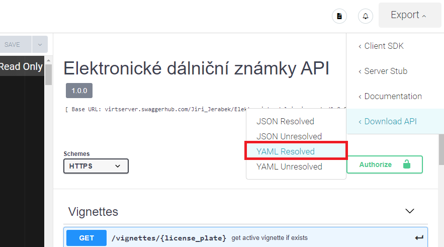

# Electronic Vignette Evidence backend
This SWI2 schools project aims to provide a simple backend to basic electronic vignettes management.
Frontend part can be found [here](https://git.pef.mendelu.cz/swi_ii/drajsajtl2).

## Running the application
You need to set environmental variable `EVE_CONF` with an absolute path to the configuration file.
You can find example configuration file in the `drajsajtl/config` directory.

Dependency management is done using [Poetry](https://python-poetry.org/).
To install dependencies use:
```bash
> poetry install --no-root
```
then, you can start the Django's dev server using:
```bash
> poetry run python manage.py runserver
```

### Running the tests
```bash
> poetry run pytest tests
```
Make sure your configuration file points to testing database.

## Swagger API Documentation
### http://localhost:8000/swagger-ui/
### Editing:

[SwaggerHub](https://app.swaggerhub.com/apis/Jiri_Jerabek/Elektronicke-dalnicni-znamky/1.0.0#/)

### Generating page
- Folder eve/swagger contains:
    - <b>swagger-yaml-to-html.py</b> - file converting yaml swagger file to actual HTML file
    - <b>generateSwaggerAPI.sh</b> - Script that you can run from PyCharm and will generate HTML template from YAML file for you.
    - <b>swagger-api.yaml</b> - file with API structure to be generated into HTML -> 
      this is the file you need to replace with new one, when you update Swagger API scheme
    
#### - Follow the files naming conventions
#### - If you can't run shell script from IDE, then run command inside eve/swagger folder: 
$ python swagger-yaml-to-html.py < swagger-api.yaml > ../templates/swagger-ui.html

### Getting updated YAML file



